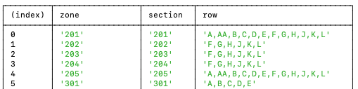
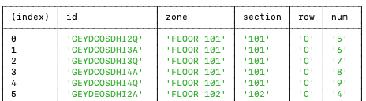
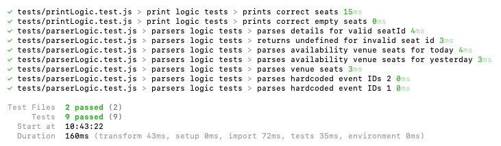
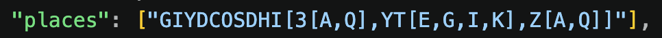

# TM Reader

A simple data comparison tool to identify which tickets were sold between two dates.

## Disclaimer

This project does not tamper with any website or its security. Users must manually copy the required API responses from their own browser session:

### Venue Seats

Request contains: `/maps/geometry/3/event/`

### Ticket Availability (for dates of interest)

Request contains: `/api/ismds/event/`

## Run

```bash
npm install
npm run start
```

## Output

### Venue Details



### Tickets Sold



## Tests

```bash
npm run test
```



## Possible Future Ideas

- Corner seat availability tracking
- Price tracking over time
- Identification of unsold/low-demand seats
- Multi-day support

## Notes

Some data is returned as a serialized tree string, which is not immediately usable in its raw form.



## Author

Jorge Donoso

## License

MIT
